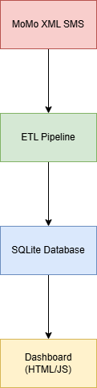

Team Setup and Project Planning

**Team Name:** CodeCrafters.

**Members:** .Abatoni M Lea (l.abatoni@alustudent.com)

             .Tuyishime Jean de Dieu (j.tuyishime6@alustudent.com)
             

## Project Overview

This project processes Mobile Money (MoMo) SMS data provided in XML format.
The system parses, cleans, categorizes, and stores transaction data in a relational
database, then displays analytics through a web-based dashboard.

## Project Structure

├── README.md
├── data/
│   ├── raw/
│   ├── processed/
│   └── db.sqlite3
├── etl/
├── web/
├── api/
├── scripts/
└── tests/

## Architecture Diagram

## Scrum Board
Scrum board available at:
https://github.com/users/LeaM103/projects/1/views/1

